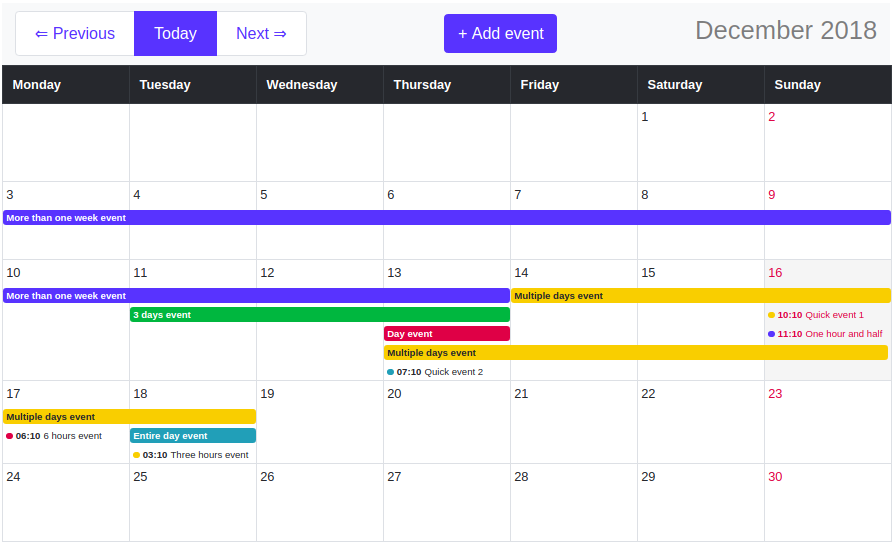

# react-monthly-events-sandbox 

The working example of [react-monthly-events](https://github.com/lzakrzewski/react-monthly-events) [React](https://reactjs.org/) component.    
You can easily setup this app on your local-machine (See [Installation](./#Installation)).

Online demo:   
[react-monthly-events.herokuapp.com](https://react-monthly-events.herokuapp.com/)

## Requirements
- [Docker](https://www.docker.com/get-started)
- [GNU make](https://www.gnu.org/software/make/manual/make.html)

## Installation 

#### Clone repo
`git clone git@github.com:lzakrzewski/react-monthly-events-sandbox.git`

#### Go to directory
`cd react-monthly-events-sandbox`

#### Run make build
`make build`

